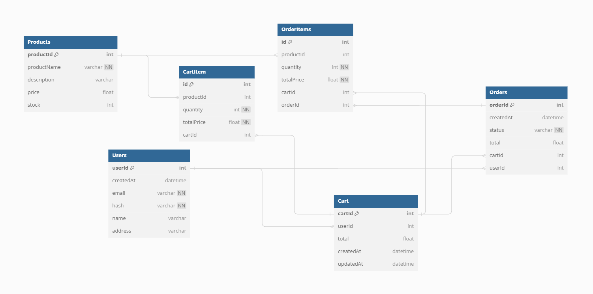
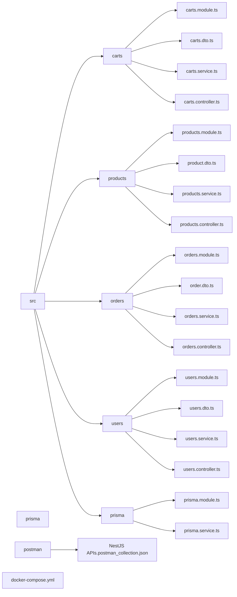

<p align="center">
  <a href="http://nestjs.com/" target="blank"></a>
</p>

[circleci-image]: https://img.shields.io/circleci/build/github/nestjs/nest/master?token=abc123def456
[circleci-url]: https://circleci.com/gh/nestjs/nest

  <p align="center">A progressive <a href="http://nodejs.org" target="_blank">Node.js</a> framework for building efficient and scalable server-side applications.</p>
    <p align="center">
<a href="https://www.npmjs.com/~nestjscore" target="_blank"></a>
<a href="https://www.npmjs.com/~nestjscore" target="_blank"></a>
<a href="https://www.npmjs.com/~nestjscore" target="_blank"></a>
<a href="https://circleci.com/gh/nestjs/nest" target="_blank"></a>
<a href="https://coveralls.io/github/nestjs/nest?branch=master" target="_blank"></a>
<a href="https://discord.gg/G7Qnnhy" target="_blank"></a>
<a href="https://opencollective.com/nest#backer" target="_blank"></a>
<a href="https://opencollective.com/nest#sponsor" target="_blank"></a>
  <a href="https://paypal.me/kamilmysliwiec" target="_blank"></a>
    <a href="https://opencollective.com/nest#sponsor"  target="_blank"></a>
  <a href="https://twitter.com/nestframework" target="_blank"></a>
</p>
  <!--[](https://opencollective.com/nest#backer)
  [](https://opencollective.com/nest#sponsor)-->
  
# E-Commerce Simple APIs with NestJS

## Description

[Nest](https://github.com/nestjs/nest) framework TypeScript beginner friendly e-commerce project starter repository.

- This project was an assignment required to implement very basic APIs for an e-commerce app.
- It includes basic CRUD operations for two main entities: cart and order.
- It is beginner-friendly, focusing on learning Nest.js, TypeScript, and Swagger.

### Resources to Learn Nest.js

To learn more about Nest.js, you can check out the following resources:

- [Nest.js Official Documentation](https://docs.nestjs.com/)
- [YouTube Tutorial: Nest.js Crash Course](https://youtu.be/GHTA143_b-s?si=TSMXYOfi9utLHTYb)

### Cloning Steps

To clone this repository and get started, use the following commands:

```bash
$ git clone https://github.com/rraneemm/slash-ecommerce.git
```

## Installation

```bash
$ pnpm install
```

## Docker Setup

To run the application with Docker Compose, follow these steps:

**Build and start the Docker containers:**

```bash
$ docker-compose up -d
```

This command will start the application containers in detached mode.

## Running the app

```bash
# development
$ pnpm run start

# watch mode
$ pnpm run start:dev
```

## Testing API Endpoints

You can test the API endpoints using Postman. Import the provided collection into Postman and start testing:

1. Start the Nest application.
2. Open Postman.
3. Import the collection `NestJS_API.postman_collection.json` located in the `postman` directory.
4. Test the endpoints as needed.

## [Database Diagram](https://dbdocs.io/ranyseleem/simple-e-commerce?view=relationships)



## Dependencies Visualization



## Contribution

This project welcomes contributions from anyone interested in learning or improving their skills with Nest.js. It's especially beginner-friendly, offering opportunities for refactoring practice and getting acquainted with the framework.

### How to Contribute

1. Fork the repository and clone it locally.

   ```bash
   $ git clone https://github.com/your-username/nest.git
   $ cd nest
   ```

2. Create a new branch for your changes.

   ```bash
   $ git checkout -b feature/your-feature-name
   ```

3. Make your modifications and improvements, focusing on refactoring or enhancing the existing codebase.

4. Test your changes thoroughly.

5. Commit your changes and push to your forked repository.

   ```bash
   $ git add .
   $ git commit -m "Add your commit message here"
   $ git push origin feature/your-feature-name
   ```

6. Open a pull request against the `main` branch of the original repository.

### Ways to Contribute

- Refactor existing code for clarity and maintainability.
- Add missing comments or documentation.
- Implement small features or enhancements.
- Improve test coverage or add new tests.

### Contribution Guidelines

- Follow the existing code style and conventions.
- Ensure your changes do not introduce linting errors or warnings.
- Write clear commit messages and PR descriptions.

By contributing to this project, you'll gain valuable experience with Nest.js and software development best practices. Don't hesitate to ask questions or seek guidance if you're new to contributing to open-source projects.

## Support

Nest is an MIT-licensed open source project. It can grow thanks to the sponsors and support by the amazing backers. If you'd like to join them, please [read more here](https://docs.nestjs.com/support).

## Stay in touch

- [Raneem Yasser](ranyseleem@gmail.com)

## License

Nest is [MIT licensed](LICENSE).
